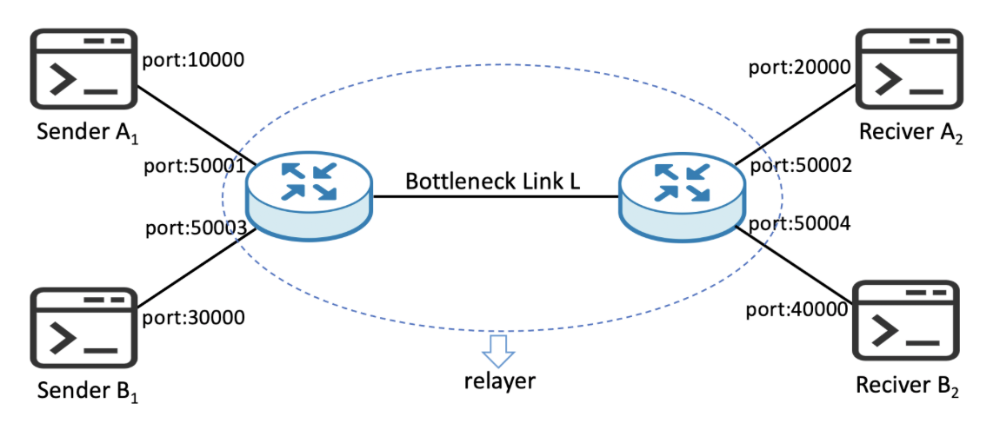

# Reliable Transport

## Background

A custom network protocol over UDP programmed to reliably send real time traffic through a simulated link. `Sender.c` and `Receiver` files are the application layer and calls the custom protocol implemented in `Relible.c` and `ReliableImpl.c` to transfer a file. The reliable transport protocol implements state transitions, connection setup and teardown. The protocol encapsulates a segment with a header and checksum, sends the data to the receiever and manages the ACK segments received. It uses sliding window in order to manage packet reordering and ensure the receiver has received all of the packets, regardless of packet loss within the link. The retransmission timer is set based on an RTO estimation. The connection is established through a three way handshake that generates an initial sequence number for the packet. The sequence numbers also wrap around the maximum limit. This custom protocol also implements congestion control through a TCP Reno like method that uses additive increase and exponential decrease when packet loss is detected through missing ACKs or retransmission timeout. This maximizes the bandwidth utilization. The congestion control is tested by measuring the fairness of mutiple connections through Jain's fairness index.

  

  Network Model

## Softwares and Technologies

   

